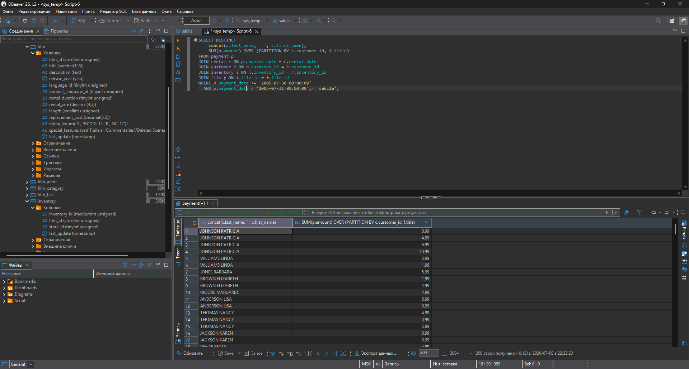

# Домашнее задание к занятию "`Индексы`" - `Лазебный Кирилл`

---

### Задание 1

`Написал запрос к учебной базе данных, который вернёт процентное отношение общего размера всех индексов к общему размеру всех таблиц.`


---

### Задание 2

`Выполните explain analyze следующего запроса:`
```
select distinct concat(c.last_name, ' ', c.first_name), sum(p.amount) over (partition by c.customer_id, f.title)
from payment p, rental r, customer c, inventory i, film f
where date(p.payment_date) = '2005-07-30' and p.payment_date = r.rental_date and r.customer_id = c.customer_id and i.inventory_id = r.inventory_id
```
`перечислил узкие места;
оптимизировал запрос: внес корректировки по использованию операторов`



Узкие места:

1. **Двойное сканирование таблицы (Full Table Scan):** 
   СУБД вынуждена обращаться к таблице `film` дважды. Сначала ей нужно просканировать все записи, чтобы вычислить общее среднее значение агрегатной функцией `AVG()`. Затем ей нужно пройтись по таблице второй раз, чтобы сравнить длину каждого отдельного фильма с полученным результатом и посчитать `COUNT`.
   
2. **Нагрузка из-за подзапроса в условии WHERE:** 
   Хотя современные планировщики запросов достаточно умны, чтобы вычислить независимый подзапрос один раз и закэшировать результат, в менее оптимизированных системах подзапрос в `WHERE` может провоцировать пересчет для каждой проверяемой строки (N+1 проблема).

3. **Отсутствие профильного индекса:** 
   Если на колонке `length` не создан индекс (например, B-Tree), базе данных приходится выполнять последовательное чтение с диска (Seq Scan). Создание индекса по этой колонке значительно ускорило бы как расчет среднего значения, так и фильтрацию строк.


---

### Задание 3

Три главных типа индексов, которые есть в PostgreSQL, но которых нет в MySQL: GIN, GiST, BRIN

---
