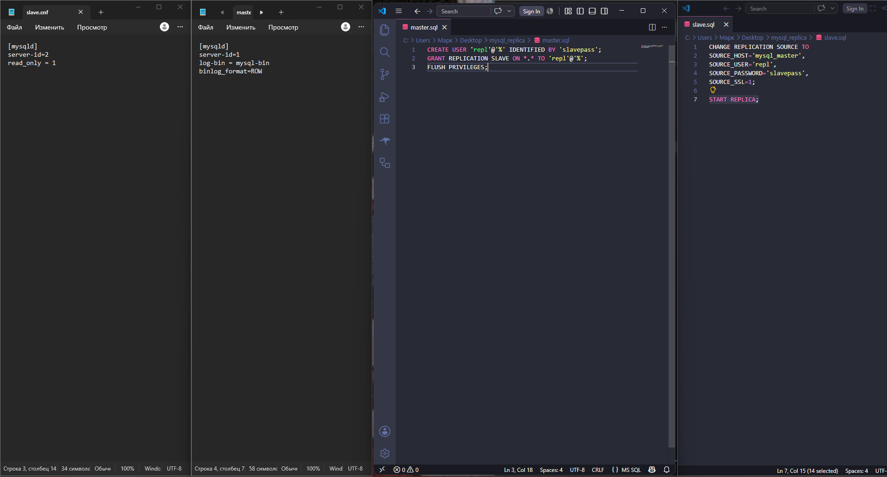
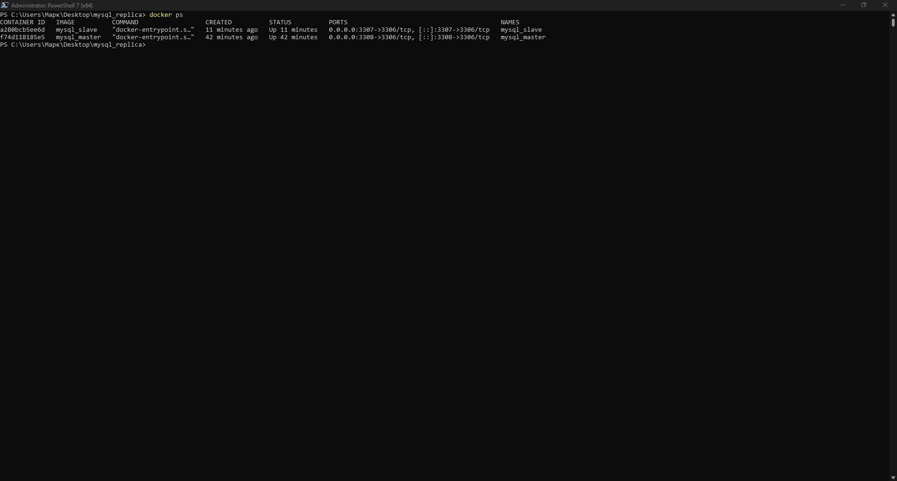
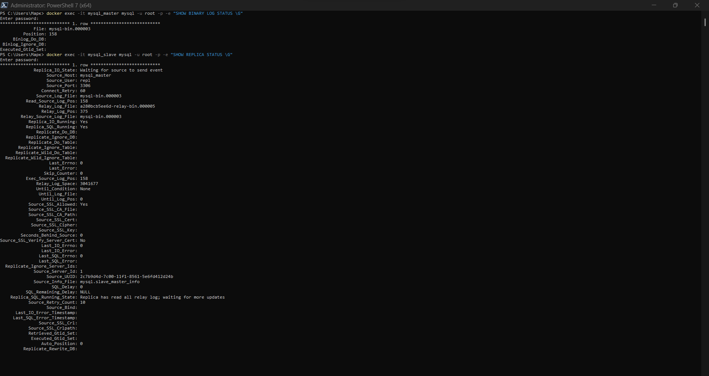

# Домашнее задание к занятию "`Репликация и масштабирование. Часть 1`" - `Лазебный Кирилл`

---

### Задание 1

`Описал различия master-slave и master-master схем.`

Master-slave: В этой архитектуре есть один главный сервер (master), который принимает запросы на запись и изменение данных, и дочерние серверы (slave), которые копируют эти данные. Слейвы обычно используются для частых операций чтения, чтобы снять нагрузку с мастера.

Master-master: В этой схеме используется два и более главных сервера, и на каждый из них разрешена запись новых данных. Это также помогает распределять нагрузку и повышает отказоустойчивость, но требует сложной настройки, так как есть высокая вероятность возникновения коллизий (конфликтов) при одновременном изменении одних и тех же данных на разных серверах.

---

### Задание 2
Конфигурации

Выполнение работы

Состояние master и slave

---

