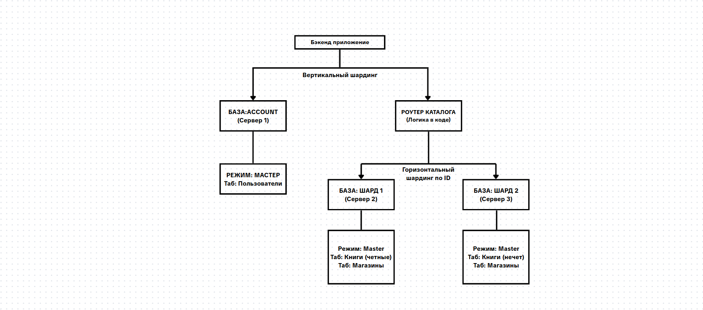

# Домашнее задание к занятию "`Репликация и масштабирование. Часть 2`" - `Лазебный Кирилл`

---

### Задание 1

`Опиcал основные преимущества использования масштабирования методами:`

- Активный master-сервер + пассивный slave-сервер:

Если основной сервер падает, резервный мгновенно забирает работу на себя. Приложение продолжает работать без долгого простоя.
Резервные копии снимаются с пассивного сервера. Это не грузит диски мастера и не тормозит работу реальных пользователей.

- Master-сервер + несколько slave-серверов:

Master только принимает новые данные, а пул слейвов отдает их. Спасает проекты, где запросов на просмотр в разы больше, чем на изменение.

Один из слейвов можно выделить исключительно под тяжелую аналитику или построение отчетов, чтобы эти процессы не вешали основной проект.

---

### Задание 2

`Разработал план для выполнения горизонтального и вертикального шаринга базы данных.`

Принципы построения и разбивки

Изоляция по смыслу (Вертикальная разбивка): Разделяем данные по бизнес-доменам. Пользователи лежат отдельно на Сервере 1. Если упадет каталог товаров, люди всё равно смогут логиниться в свои аккаунты.

Распределение нагрузки (Горизонтальная разбивка): Связанные данные (книги и магазины) режутся по ID. Это позволяет равномерно распределить гигантский объем информации и запросов между независимыми Сервером 2 и Сервером 3.

---

